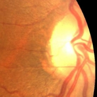
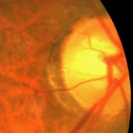
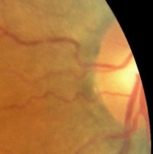

# Dataset
## Segmentation
We used mainly 2 dataset for segmentation problem Retinal fundus images for glaucoma analysis (RIGA) [1], and Retinal Fundus Glaucoma Challenge Edition2 (REFUGE2) [2].
### RIGA
RIGA dataset consists of 3 different fundus image open datasets namely  BinRushed, Messidor and Magrabia which contain 195, 460 and 95 images respectively. And all those fundus images are annotated by 6 opthamologists.

But those annotations were made directly to the images itself without using a layer, as shown in figure below. Therefore, an image preprocessing is needed for creating masks for this dataset. Therefore we implemented an algorithm with following steps:

1. Take the pixel difference between original and annotated image.
1. Set all pixels to 1 which has a value higher than predefined threshold.
1. Find first black pixel inside of outer circle
1. Fill the area between outer and inner circles in a new space (disc\_minus\_cup)
1. Find a pixel in inner circle
1. Fill inner circle in a new space (inside\_cup)
1. Create disc space (inside\_cup + disc\_minus\_cup)

Related code can be found in [this link](https://github.com/alegoritma/CSE-ImageProcessing-Project/blob/main/RIGA_Mask_Creator.ipynb).
### REFUGE2
Refuge2 dataset contains 1200 color fundus photographs in total, where equally splitted into training, validation and test. Since the train and validation sets contain masks/labels (a.k.a ground truth), the test set doesn’t. In addition the train set also comes with corresponding glaucoma status.
## Localization
Since labeling optic discs does not require professional competence, we labeled optic discs in all fundus images we gathered for the segmentation problem.
## Test Dataset
For testing our models, we used a dataset on kaggle with title **Ocular Disease Recognition[3].** Where all the images collected by Shanggong Medical Technology Co., Ltd. from various medical resources in China. While this dataset contains various diseases like diabetes, macular degeneration and so on, we only used those images where labeled either normal fundus or glaucoma. While there are 204 and 1645 images for glaucoma and normal fundus respectively. We selected 204 random samples from normal fundus images to balance the dataset. Then we cropped optic discs from all those images with our optic disc localization model, and saved them in folders which are seperated as glaucoma positive and negative.


After we made a sanity check on our cropping results, we found out there are images which we cannot use for testing. For example, cropped images below don't cover optic discs fully.




Related code: [Link](https://github.com/alegoritma/CSE-ImageProcessing-Project/blob/main/Test_Dataset_Creator.ipynb)

# Experimentation
## Segmentation
We started training with Mnet and U-Net, with pixel based categorical cross entropy. But unfortunately, this trial hasn't provided any satisfying results. And then we decided to use a different loss which is specifically used for segmentation problems, namely, Dice Loss[4]. Dice loss led us to have better results, but these results were still not satisfying. 

While searching for a better metric for our specific problem, we came up with an idea where we could use cup to disc ratios between ground truth and prediction results as loss, which we called cup to disc loss shown in the code below.


```py
@tf.function
def cdr_loss(y_true, y_pred):
  pred_mask = tf.argmax(y_pred, axis=-1)
  y_pred_disc_sum = tf.reduce_sum(
      tf.cast(tf.not_equal(pred_mask, 0), tf.float32), 
      axis=[1,2])
  y_pred_cup_sum = tf.reduce_sum(
      tf.cast(tf.equal(pred_mask, 2), tf.float32), 
      axis=[1,2])
  
  pred_ratio = tf.math.sqrt(
      tf.math.divide_no_nan(
          y_pred_cup_sum, 
          y_pred_disc_sum))
  

  y_true_disc_sum = tf.reduce_sum(
      tf.cast(tf.not_equal(y_true, 0), tf.float32), 
      axis=[1,2])[:,0]
  y_true_cup_sum = tf.reduce_sum(
      tf.cast(tf.equal(y_true, 2), tf.float32), 
      axis=[1,2])[:,0]

  true_ratio = tf.math.sqrt(
      tf.math.divide_no_nan(
          y_true_cup_sum, 
          y_true_disc_sum))

  error = tf.abs(tf.subtract(pred_ratio, true_ratio))
  sqrt_error = tf.reduce_sum(tf.math.sqrt(error))
  return sqrt_error

 
@tf.function
def scc_dice_cdr_loss(y_true, y_pred):
  loss = tf.reduce_mean(
      tf.keras.losses.sparse_categorical_crossentropy(
          y_true, 
          y_pred, 
          from_logits=True))
  _dice_loss = dice_loss_2_class(y_true, y_pred)
  _cdr_loss = cdr_loss(y_true, y_pred)
  return (loss + _dice_loss + _cdr_loss*0.7) * (1. / BATCH_SIZE)
```


After a couple trials, we found out that we are obtaining best results when we combine categorical cross entropy and dice loss with the cup to disc loss and we took the best results with the U-Net model. Final result shown in figure below. 


First, we trained the unet model without any preprocessing and we had a 85% auc score, but only 90% of our predictions were valid due to bad mask prediction.

Then we applied histogram equalization to our test dataset and predicted again, and valid mask predictions increased to 97%, but our auc score dropped to 58% this time. Which indicated poor masking results.

As the third approach we used histogram stretching per color (red, green and blue) this time and we got 96% of valid results with 84.5% auc score. After this point we decided to fine-tune our current model with the same training dataset after applied histogram stretching, thereby, we mapped all our training dataset images to the following code:

```py
@tf.function
def tf_strech_histogram(image, *args):
  rmax = tf.reduce_max(image, axis=[-3,-2])
  rmin = tf.reduce_min(image, axis=[-3,-2])
  return ((image-rmin)/(rmax-rmin), *args)
train_dataset = train_dataset.map(tf_strech_histogram)
```

Thus, we reached the highest valid results with 97% and auc score with 88% after we tested our model on the same dataset after histogram stretching applied. Details can be seen in the table below.

<table class=a border=1 cellspacing=0 cellpadding=0 width=625 style='border-collapse:
 collapse;border:none'>
 <tr style='height:14.25pt'>
  <td width=181 colspan=2 valign=top style='width:135.75pt;border:solid black 1.0pt;
  padding:5.0pt 5.0pt 5.0pt 5.0pt;height:14.25pt'>
  <p class=MsoNormal align=center style='text-align:center;border:none'><b><span
  lang=EN>Method Applied</span></b></p>
  </td>
  <td width=444 colspan=5 valign=top style='width:333.0pt;border:solid black 1.0pt;
  border-left:none;padding:5.0pt 5.0pt 5.0pt 5.0pt;height:14.25pt'>
  <p class=MsoNormal align=center style='text-align:center;border:none'><b><span
  lang=EN>Score</span></b></p>
  </td>
 </tr>
 <tr style='height:25.0pt'>
  <td width=98 valign=top style='width:73.5pt;border:none;border-left:solid black 1.0pt;
  background:black;padding:5.0pt 5.0pt 5.0pt 5.0pt;height:25.0pt'>
  <p class=MsoNormal style='border:none'><b><span lang=EN style='font-family:
  Roboto;color:white'>Train Dataset</span></b></p>
  </td>
  <td width=83 valign=top style='width:62.25pt;border:none;background:black;
  padding:5.0pt 5.0pt 5.0pt 5.0pt;height:25.0pt'>
  <p class=MsoNormal style='border:none'><b><span lang=EN style='font-family:
  Roboto;color:white'>Test Dataset</span></b></p>
  </td>
  <td width=98 valign=top style='width:73.5pt;border:none;background:black;
  padding:5.0pt 5.0pt 5.0pt 5.0pt;height:25.0pt'>
  <p class=MsoNormal style='border:none'><b><span lang=EN style='font-family:
  Roboto;color:white'>Sensitivity</span></b></p>
  </td>
  <td width=94 valign=top style='width:70.5pt;border:none;background:black;
  padding:5.0pt 5.0pt 5.0pt 5.0pt;height:25.0pt'>
  <p class=MsoNormal style='border:none'><b><span lang=EN style='font-family:
  Roboto;color:white'>Specificity</span></b></p>
  </td>
  <td width=67 valign=top style='width:50.25pt;border:none;background:black;
  padding:5.0pt 5.0pt 5.0pt 5.0pt;height:25.0pt'>
  <p class=MsoNormal style='border:none'><b><span lang=EN style='font-family:
  Roboto;color:white'>AUC</span></b></p>
  </td>
  <td width=83 valign=top style='width:62.25pt;border:none;background:black;
  padding:5.0pt 5.0pt 5.0pt 5.0pt;height:25.0pt'>
  <p class=MsoNormal style='border:none'><b><span lang=EN style='font-family:
  Roboto;color:white'>Accuracy</span></b></p>
  </td>
  <td width=102 valign=top style='width:76.5pt;border:none;border-right:solid black 1.0pt;
  background:black;padding:5.0pt 5.0pt 5.0pt 5.0pt;height:25.0pt'>
  <p class=MsoNormal style='border:none'><b><span lang=EN style='font-family:
  Roboto;color:white'>Valid Percentage</span></b></p>
  </td>
 </tr>
 <tr style='height:22.5pt'>
  <td width=98 valign=top style='width:73.5pt;border-top:solid black 1.0pt;
  border-left:solid black 1.0pt;border-bottom:none;border-right:none;
  padding:5.0pt 5.0pt 5.0pt 5.0pt;height:22.5pt'>
  <p class=MsoNormal style='border:none'><b><span lang=EN style='font-family:
  Roboto'>-</span></b></p>
  </td>
  <td width=83 valign=top style='width:62.25pt;border:none;border-top:solid black 1.0pt;
  padding:5.0pt 5.0pt 5.0pt 5.0pt;height:22.5pt'>
  <p class=MsoNormal style='border:none'><b><span lang=EN style='font-family:
  Roboto'>Hist. Eq.</span></b></p>
  </td>
  <td width=98 valign=top style='width:73.5pt;border:none;border-top:solid black 1.0pt;
  padding:6.0pt 5.0pt 6.0pt 5.0pt;height:22.5pt'>
  <p class=MsoNormal style='border:none'><span lang=EN style='font-family:Roboto'>40.9%</span></p>
  </td>
  <td width=94 valign=top style='width:70.5pt;border:none;border-top:solid black 1.0pt;
  padding:6.0pt 5.0pt 6.0pt 5.0pt;height:22.5pt'>
  <p class=MsoNormal style='border:none'><span lang=EN style='font-family:Roboto'>75.7%</span></p>
  </td>
  <td width=67 valign=top style='width:50.25pt;border:none;border-top:solid black 1.0pt;
  padding:6.0pt 5.0pt 6.0pt 5.0pt;height:22.5pt'>
  <p class=MsoNormal style='border:none'><span lang=EN style='font-family:Roboto'>58.7%</span></p>
  </td>
  <td width=83 valign=top style='width:62.25pt;border:none;border-top:solid black 1.0pt;
  padding:6.0pt 5.0pt 6.0pt 5.0pt;height:22.5pt'>
  <p class=MsoNormal style='border:none'><span lang=EN style='font-family:Roboto'>56.7%</span></p>
  </td>
  <td width=102 valign=top style='width:76.5pt;border-top:solid black 1.0pt;
  border-left:none;border-bottom:none;border-right:solid black 1.0pt;
  padding:6.0pt 5.0pt 6.0pt 5.0pt;height:22.5pt'>
  <p class=MsoNormal style='border:none'><span lang=EN style='font-family:Roboto'>97.9%</span></p>
  </td>
 </tr>
 <tr style='height:20.25pt'>
  <td width=98 valign=top style='width:73.5pt;border-top:solid black 1.0pt;
  border-left:solid black 1.0pt;border-bottom:none;border-right:none;
  padding:5.0pt 5.0pt 5.0pt 5.0pt;height:20.25pt'>
  <p class=MsoNormal style='border:none'><b><span lang=EN style='font-family:
  Roboto'>Hist. St.</span></b></p>
  </td>
  <td width=83 valign=top style='width:62.25pt;border:none;border-top:solid black 1.0pt;
  padding:5.0pt 5.0pt 5.0pt 5.0pt;height:20.25pt'>
  <p class=MsoNormal style='border:none'><b><span lang=EN style='font-family:
  Roboto'>-</span></b></p>
  </td>
  <td width=98 valign=top style='width:73.5pt;border:none;border-top:solid black 1.0pt;
  padding:6.0pt 5.0pt 6.0pt 5.0pt;height:20.25pt'>
  <p class=MsoNormal style='border:none'><span lang=EN style='font-family:Roboto'>80.1%</span></p>
  </td>
  <td width=94 valign=top style='width:70.5pt;border:none;border-top:solid black 1.0pt;
  padding:6.0pt 5.0pt 6.0pt 5.0pt;height:20.25pt'>
  <p class=MsoNormal style='border:none'><span lang=EN style='font-family:Roboto'>76.0%</span></p>
  </td>
  <td width=67 valign=top style='width:50.25pt;border:none;border-top:solid black 1.0pt;
  padding:6.0pt 5.0pt 6.0pt 5.0pt;height:20.25pt'>
  <p class=MsoNormal style='border:none'><span lang=EN style='font-family:Roboto'>81.6%</span></p>
  </td>
  <td width=83 valign=top style='width:62.25pt;border:none;border-top:solid black 1.0pt;
  padding:6.0pt 5.0pt 6.0pt 5.0pt;height:20.25pt'>
  <p class=MsoNormal style='border:none'><span lang=EN style='font-family:Roboto'>76.5%</span></p>
  </td>
  <td width=102 valign=top style='width:76.5pt;border-top:solid black 1.0pt;
  border-left:none;border-bottom:none;border-right:solid black 1.0pt;
  padding:6.0pt 5.0pt 6.0pt 5.0pt;height:20.25pt'>
  <p class=MsoNormal style='border:none'><span lang=EN style='font-family:Roboto'>94.3%</span></p>
  </td>
 </tr>
 <tr style='height:9.0pt'>
  <td width=98 valign=top style='width:73.5pt;border-top:solid black 1.0pt;
  border-left:solid black 1.0pt;border-bottom:none;border-right:none;
  padding:5.0pt 5.0pt 5.0pt 5.0pt;height:9.0pt'>
  <p class=MsoNormal style='border:none'><b><span lang=EN style='font-family:
  Roboto'>Hist. St.</span></b></p>
  </td>
  <td width=83 valign=top style='width:62.25pt;border:none;border-top:solid black 1.0pt;
  padding:5.0pt 5.0pt 5.0pt 5.0pt;height:9.0pt'>
  <p class=MsoNormal style='border:none'><b><span lang=EN style='font-family:
  Roboto'>Hist. Eq.</span></b></p>
  </td>
  <td width=98 valign=top style='width:73.5pt;border:none;border-top:solid black 1.0pt;
  padding:6.0pt 5.0pt 6.0pt 5.0pt;height:9.0pt'>
  <p class=MsoNormal style='border:none'><span lang=EN style='font-family:Roboto'>73.7%</span></p>
  </td>
  <td width=94 valign=top style='width:70.5pt;border:none;border-top:solid black 1.0pt;
  padding:6.0pt 5.0pt 6.0pt 5.0pt;height:9.0pt'>
  <p class=MsoNormal style='border:none'><span lang=EN style='font-family:Roboto'>80.4%</span></p>
  </td>
  <td width=67 valign=top style='width:50.25pt;border:none;border-top:solid black 1.0pt;
  padding:6.0pt 5.0pt 6.0pt 5.0pt;height:9.0pt'>
  <p class=MsoNormal style='border:none'><span lang=EN style='font-family:Roboto'>83.3%</span></p>
  </td>
  <td width=83 valign=top style='width:62.25pt;border:none;border-top:solid black 1.0pt;
  padding:6.0pt 5.0pt 6.0pt 5.0pt;height:9.0pt'>
  <p class=MsoNormal style='border:none'><span lang=EN style='font-family:Roboto'>75.4%</span></p>
  </td>
  <td width=102 valign=top style='width:76.5pt;border-top:solid black 1.0pt;
  border-left:none;border-bottom:none;border-right:solid black 1.0pt;
  padding:6.0pt 5.0pt 6.0pt 5.0pt;height:9.0pt'>
  <p class=MsoNormal style='border:none'><span lang=EN style='font-family:Roboto'>96.9%</span></p>
  </td>
 </tr>
 <tr>
  <td width=98 valign=top style='width:73.5pt;border-top:solid black 1.0pt;
  border-left:solid black 1.0pt;border-bottom:none;border-right:none;
  padding:5.0pt 5.0pt 5.0pt 5.0pt'>
  <p class=MsoNormal style='border:none'><b><span lang=EN style='font-family:
  Roboto'>-</span></b></p>
  </td>
  <td width=83 valign=top style='width:62.25pt;border:none;border-top:solid black 1.0pt;
  padding:5.0pt 5.0pt 5.0pt 5.0pt'>
  <p class=MsoNormal style='border:none'><b><span lang=EN style='font-family:
  Roboto'>Hist. St.</span></b></p>
  </td>
  <td width=98 valign=top style='width:73.5pt;border:none;border-top:solid black 1.0pt;
  padding:6.0pt 5.0pt 6.0pt 5.0pt'>
  <p class=MsoNormal style='border:none'><span lang=EN style='font-family:Roboto'>80.1%</span></p>
  </td>
  <td width=94 valign=top style='width:70.5pt;border:none;border-top:solid black 1.0pt;
  padding:6.0pt 5.0pt 6.0pt 5.0pt'>
  <p class=MsoNormal style='border:none'><span lang=EN style='font-family:Roboto'>80.2%</span></p>
  </td>
  <td width=67 valign=top style='width:50.25pt;border:none;border-top:solid black 1.0pt;
  padding:6.0pt 5.0pt 6.0pt 5.0pt'>
  <p class=MsoNormal style='border:none'><span lang=EN style='font-family:Roboto'>84.6%</span></p>
  </td>
  <td width=83 valign=top style='width:62.25pt;border:none;border-top:solid black 1.0pt;
  padding:6.0pt 5.0pt 6.0pt 5.0pt'>
  <p class=MsoNormal style='border:none'><span lang=EN style='font-family:Roboto'>78.5%</span></p>
  </td>
  <td width=102 valign=top style='width:76.5pt;border-top:solid black 1.0pt;
  border-left:none;border-bottom:none;border-right:solid black 1.0pt;
  padding:6.0pt 5.0pt 6.0pt 5.0pt'>
  <p class=MsoNormal style='border:none'><span lang=EN style='font-family:Roboto'>96.6%</span></p>
  </td>
 </tr>
 <tr>
  <td width=98 valign=top style='width:73.5pt;border-top:solid black 1.0pt;
  border-left:solid black 1.0pt;border-bottom:none;border-right:none;
  padding:5.0pt 5.0pt 5.0pt 5.0pt'>
  <p class=MsoNormal style='border:none'><b><span lang=EN style='font-family:
  Roboto'>-</span></b></p>
  </td>
  <td width=83 valign=top style='width:62.25pt;border:none;border-top:solid black 1.0pt;
  padding:5.0pt 5.0pt 5.0pt 5.0pt'>
  <p class=MsoNormal style='border:none'><b><span lang=EN style='font-family:
  Roboto'>-</span></b></p>
  </td>
  <td width=98 valign=top style='width:73.5pt;border:none;border-top:solid black 1.0pt;
  padding:6.0pt 5.0pt 6.0pt 5.0pt'>
  <p class=MsoNormal style='border:none'><span lang=EN style='font-family:Roboto'>83.9%</span></p>
  </td>
  <td width=94 valign=top style='width:70.5pt;border:none;border-top:solid black 1.0pt;
  padding:6.0pt 5.0pt 6.0pt 5.0pt'>
  <p class=MsoNormal style='border:none'><span lang=EN style='font-family:Roboto'>78.9%</span></p>
  </td>
  <td width=67 valign=top style='width:50.25pt;border:none;border-top:solid black 1.0pt;
  padding:6.0pt 5.0pt 6.0pt 5.0pt'>
  <p class=MsoNormal style='border:none'><span lang=EN style='font-family:Roboto'>85.9%</span></p>
  </td>
  <td width=83 valign=top style='width:62.25pt;border:none;border-top:solid black 1.0pt;
  padding:6.0pt 5.0pt 6.0pt 5.0pt'>
  <p class=MsoNormal style='border:none'><span lang=EN style='font-family:Roboto'>79.7%</span></p>
  </td>
  <td width=102 valign=top style='width:76.5pt;border-top:solid black 1.0pt;
  border-left:none;border-bottom:none;border-right:solid black 1.0pt;
  padding:6.0pt 5.0pt 6.0pt 5.0pt'>
  <p class=MsoNormal style='border:none'><span lang=EN style='font-family:Roboto'>90.4%</span></p>
  </td>
 </tr>
 <tr>
  <td width=98 valign=top style='width:73.5pt;border:solid black 1.0pt;
  border-right:none;padding:5.0pt 5.0pt 5.0pt 5.0pt'>
  <p class=MsoNormal style='border:none'><b><span lang=EN style='font-family:
  Roboto'>Hist. St.</span></b></p>
  </td>
  <td width=83 valign=top style='width:62.25pt;border-top:solid black 1.0pt;
  border-left:none;border-bottom:solid black 1.0pt;border-right:none;
  padding:5.0pt 5.0pt 5.0pt 5.0pt'>
  <p class=MsoNormal style='border:none'><b><span lang=EN style='font-family:
  Roboto'>Hist. St.</span></b></p>
  </td>
  <td width=98 valign=top style='width:73.5pt;border-top:solid black 1.0pt;
  border-left:none;border-bottom:solid black 1.0pt;border-right:none;
  padding:6.0pt 5.0pt 6.0pt 5.0pt'>
  <p class=MsoNormal style='border:none'><span lang=EN style='font-family:Roboto'>86.4%</span></p>
  </td>
  <td width=94 valign=top style='width:70.5pt;border-top:solid black 1.0pt;
  border-left:none;border-bottom:solid black 1.0pt;border-right:none;
  padding:6.0pt 5.0pt 6.0pt 5.0pt'>
  <p class=MsoNormal style='border:none'><span lang=EN style='font-family:Roboto'>77.2%</span></p>
  </td>
  <td width=67 valign=top style='width:50.25pt;border-top:solid black 1.0pt;
  border-left:none;border-bottom:solid black 1.0pt;border-right:none;
  padding:6.0pt 5.0pt 6.0pt 5.0pt'>
  <p class=MsoNormal style='border:none'><span lang=EN style='font-family:Roboto'>88.2%</span></p>
  </td>
  <td width=83 valign=top style='width:62.25pt;border-top:solid black 1.0pt;
  border-left:none;border-bottom:solid black 1.0pt;border-right:none;
  padding:6.0pt 5.0pt 6.0pt 5.0pt'>
  <p class=MsoNormal style='border:none'><span lang=EN style='font-family:Roboto'>80.2%</span></p>
  </td>
  <td width=102 valign=top style='width:76.5pt;border:solid black 1.0pt;
  border-left:none;padding:6.0pt 5.0pt 6.0pt 5.0pt'>
  <p class=MsoNormal style='border:none'><span lang=EN style='font-family:Roboto'>97.2%</span></p>
  </td>
 </tr>
</table>

[1]: Almazroa, A., Alodhayb, S., Osman, E., Ramadan, E., Hummadi, M., Dlaim, M. & Lakshminarayanan, V. (2018, March). Retinal fundus images for glaucoma analysis: the RIGA dataset. In *Medical Imaging 2018: Imaging Informatics for Healthcare, Research, and Applications* (Vol. 10579, p. 105790B). International Society for Optics and Photonics.

[2]\: https://ai.baidu.com/broad/introduction?dataset=gon

[3]\: https://www.kaggle.com/andrewmvd/ocular-disease-recognition-odir5k

[4]\: https://arxiv.org/pdf/1707.03237.pdf
